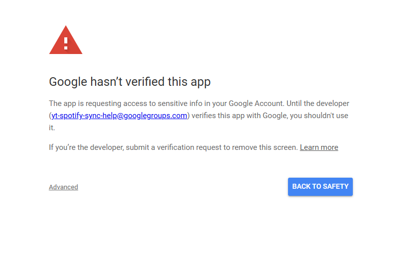
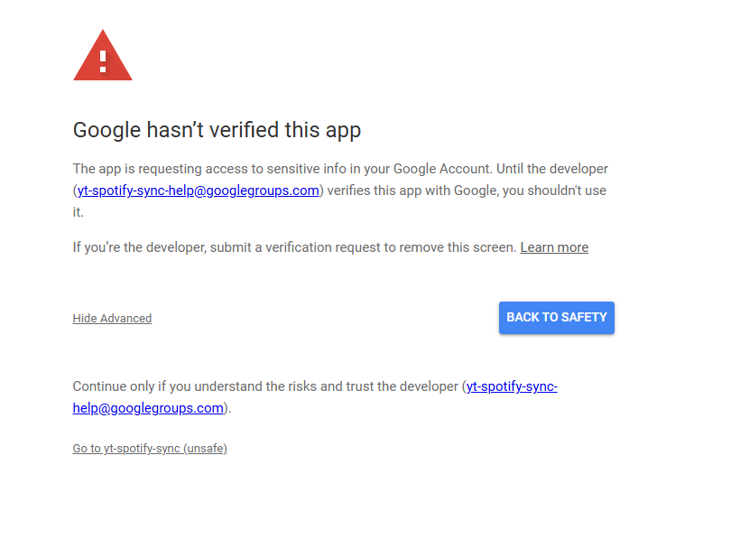
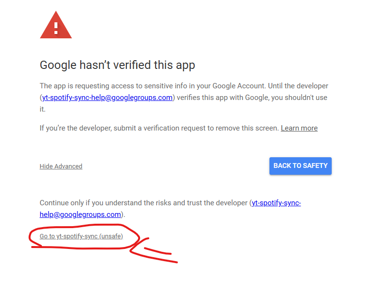

# yt-spotify-sync
A CLI to sync a YouTube and Spotify playlist to have the same songs

## Features

 - Sync the songs on your spotify playlist to youtube and vise versa 
 - A Simple CLI to use it.

## Install

On the github page click releases https://github.com/ArmadilloMike/yt-spotify-sync/releases and choose the latest version. Run the exe to start the app

## Login with google issues

When you are asked to login to google it will show a screen saying the app is not verified.

Click advanced

Then click go to yt-spotify-sync to complete the process

## Development 

Rename the env.example to .env and fill in the required fields. Then place the google client_secret.json in the root directory. Make sure it is named client_secret.json and nothing else